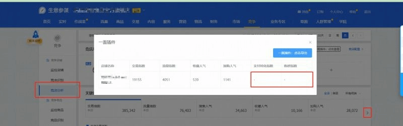
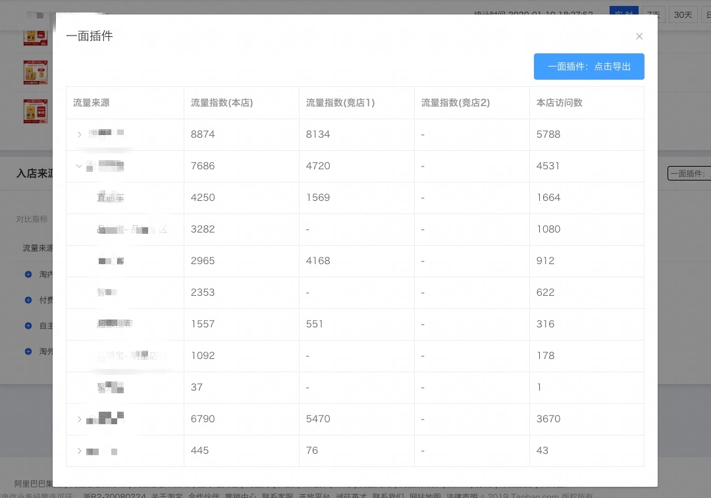

# chrome-plugin-sycm

生意参谋 chrome 插件，目前能够实现几个分类的数据获取和下载。

此项目已搬到我司 gitlab 上面，**这里的已经不再维护了**。

## Demo




## Develop

```
npm install
npm start
npm run build
```

## How to use

1. npm run build，插件会被打包到 ym-sycm-plugin 文件夹；
2. 打开 chrome 的扩展程序，并切换到开发者模式
3. 把 ym-sycm-plugin 文件夹拖进去即可

